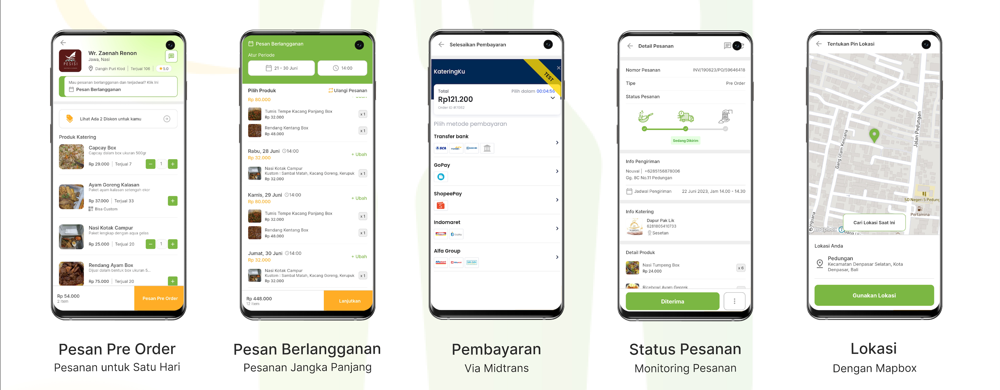

# KateringKu

A comprehensive marketplace application, developed using Flutter and Laravel, that connects caterers with buyers, enabling seamless transactions with features for direct ordering and payment within the app, ensuring a smooth and efficient food purchasing experience.

## Problem & Solution
The problem addressed is the difficulty faced by many catering businesses in establishing an online presence and the mismatch between popular online food delivery apps like GoFood and GrabFood with their production systems. 

The solution is to develop a mobile application that serves as a marketplace, allowing catering services to market their products online. This platform would include features for easy ordering and payment within the app. Additionally, buyers would have the option to subscribe to meal plans with flexible delivery schedules suited to their needs.

Overall, this marketplace app bridges the gap between caterers and customers, enhancing the accessibility and efficiency of the catering industry.

## Preview

## Tech Requirements
- Flutter
- Laravel (RestAPI)
- MySQL
- Firebase Cloud Messaging
- Mapbox
- Midtrans

